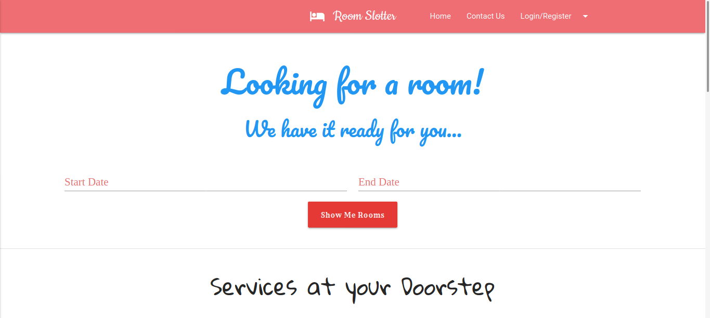
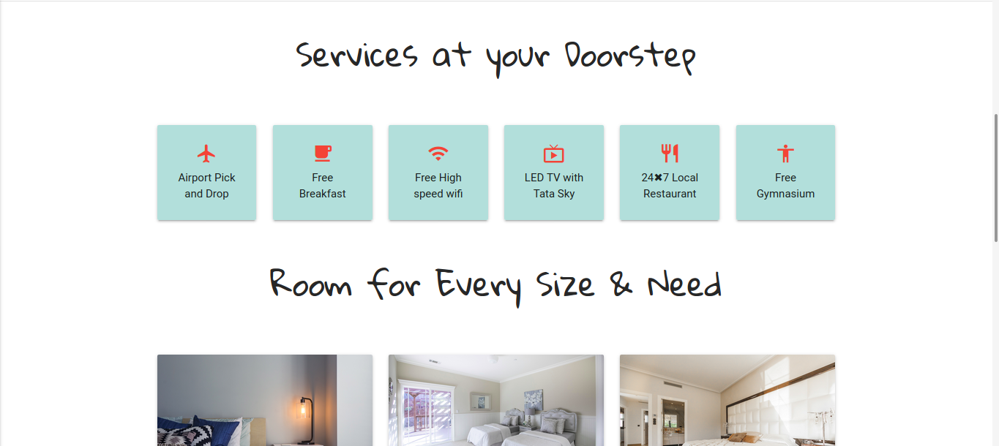
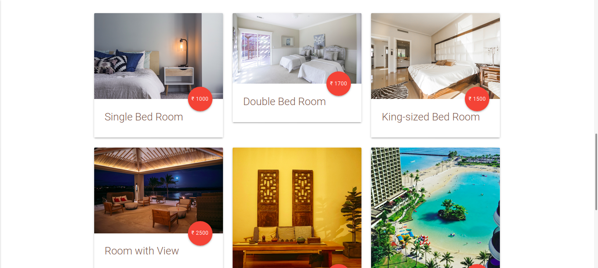
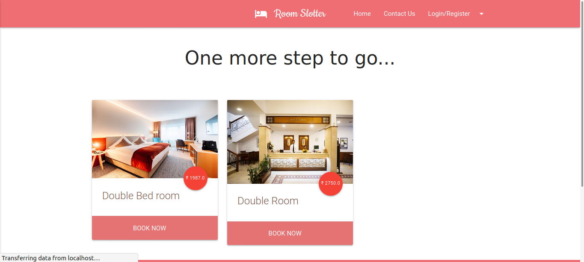
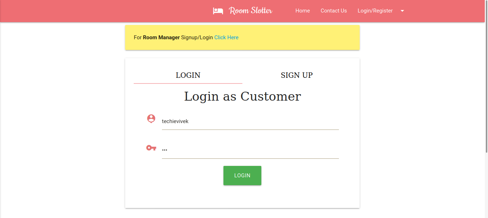
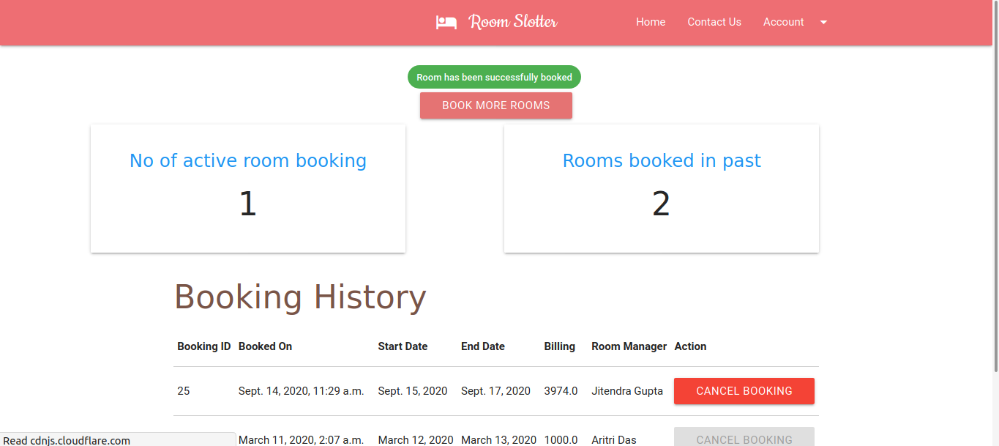

# Hotel Management Django App
Hotel room booking and management app in Django(Python).

# Features
- Material design based UI.
- Login and Signup functionality.
- Customers can book room based on availability.
- See the booking history and edit order from the dashboard.

# Screenshot

 
 
 
 
 
  

# Technology Used
 - HTML/CSS
 - [Materialize CSS](archives.materializecss.com/0.100.2)
 - Javascript( particularly AJAX, DOM)
 - Git
 - Django
# How to run the project
 - clone the repository.
 - Move to newly created git directory as `cd Hotel-Management`
 - Install virtualenv as `sudo pip3 install virtualenv`
 - Create a new virtual environment as `python3 -m venv demo_venv` (`demo_venv` is the name of your virtual environment, you can name it anything)
 - Activate the newly created virtual environement `source demo_venv/bin/activate`
 - Install all the dependencies as `pip install -r requirements.txt`
 - Traverse to the room_slot **main** directory as `cd room_slot` (This is the place where all source file are kept).
 - Start the development Server as `python manage.py runserver`
 - Visit `localhost:8000` in your browser to view the site live.
 - To deactivate virtual environment anytime use `deactivate`
# Features of the project
 - Fully responsive website(for both mobile and larger screens) based on google material design.
 - Login/Signup/Logout feature for both Customer and Room Manager.
 - Custom dashboard for both Customer and Room Manager.
 - Facility to add, delete, update rooms by Room Manager.
 - Room Manager can see the details of user that has booked one of his rooms.
 - Customer can cancel the room booking.
 - Contact form support for every visitor of website.
 - Superuser have access to all the functionality listed above.
 
